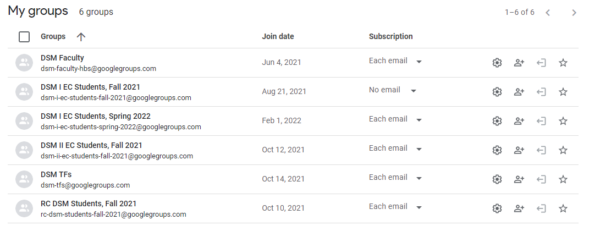

# Data Science for Managers

<a href="https://dsmcourse.business/" target="_blank">dsmcourse.business</a>

The Data Science for Managers (DSM) course is primarily managed across three different platforms:
  1. The course website, which serves as the textbook for the course. This contains readings, videos, and coding exercises that students work through outside of class. The materials for this site are contained and managed in this Github repository.
  2. Google Drive, which is used to manage the Colab notebooks and polls that we use in the course.
  3. Canvas, which is used to manage assignments and announcements. 

This README describes best practices for managing materials across all three of these platforms. 

## Textbook Materials

## Google Materials

**Username:** dsmfaculty@gmail.com

**Password:** DataScienceForManagers

All Colab notebooks and Google Polls for the course are managed on Google Drive. The account above is the primary owner of all of these materials. 

### Drive Folder

With such a large team of faculty, teaching fellows, and research associates working on the course, it is imperative that the Drive folder is well organized and maintained. The folder should be intuitively designed such that it is obvious where all materials are stored with the folder. There should also be a README file in the root of the folder that describes how the folder is structured. 

The dsmfaculty@gmail.com account owns the master folder for the course called "DSM" (direct link [here](https://drive.google.com/drive/folders/1cBOCc2-X58ySGGwkP85ArtoCfRuiAPar?usp=sharing)). This folder contains the following subfolders:
+ `"Book"` - A permanent folder with all of the materials (Colab notebooks, polls, etc.) that are used in the course textbook.
+ Course Folders (e.g. `"DSM I (Spring 2022, EC)"`) - These folders are used to manage the Drive materials for any current iterations of the course. When creating a folder for a new iteration of the course, follow the naming convention used in the previous versions of the course.
+ `"!Archived"` - A folder with archived course folders from previous iterations of the course. You can peruse these folders to see how we have organized materials in the past. 

To see how course folders are organized, here are the contents of the `"DSM I (Fall 2021, EC)"` folder within `"Archived"`:

And here are the contents of the `"Folder Structure (README).png"` file:

As shown in the README, there are three primary subfolders: `"!Temp"`, which is used to store and share temporary documents to prevent the rest of the course folder from getting cluttered; `"Admin"`, which stores administrative documents such as the syllabus, course overview note, course calendar, etc.; and `"Class Materials"`, which contains subfolders for each class in the course. Each one of these class folders contains all the necessary materials (documents, data, code notebooks, etc.) for the relevant class session.  

Let's look into one of the class folders, for example `"Class 4"`. This contains the following:
+ `"data"` - All of the data sets for Class 4, including the case data the students will analyze during class (`"lexoo_transactions.csv"`) and the data that is used in the prework (`"gss_data.csv"`, `"wsj_table.csv"`)
+ `"documents"` - Any relevant documents, such as teaching plans and teaching notes.
+ `"notebooks"` - All of the Colab notebooks for Class 4, including notebooks assigned as prework (`"Class 4: Videos.ipynb"`), the starter notebook for the case that will be shared with students (`"Class 4: Lexoo.ipynb"`), and the finisher notebook for the case with the suggested answers (`"Class 4: Lexoo (FINISHER).ipynb"`). 
+ `"polls"` - Google polls use to collect feedback, and occasionally student answers to case questions. 
+ `"Class 4: Assignment Sheet.ipynb"` - The assignment sheet for Class 4 that is given to the students. In this iteration of the course we created the assignment sheets as Colab notebooks, but subsequently we have changed to writing assignment sheets as Google Docs.

#### Colab Notebooks

All coding in the course is done within Colab notebooks. There are several important points to note about Colab notebooks:
+ Google does not officially support the R kernel for Colab, so we have developed a workaround to run R within Colab. To create an R notebook, you must copy a pre-existing notebook that is set up with the R kernel. We have saved an R notebook template under the outer `"DSM"` folder called `"Notebook Template.ipynb"`, so whenever you want to create a new notebook you should copy this template, move it to the approriate folder, and work within that copy. 
+ It is best practice to maintain two versions of each notebook: the "live" version of the notebook that is distributed to the students, and the "finisher" notebook for faculty and teaching fellows that contains all of the answers/code. The live version contains some code cells with `# ADD COMMAND(S) HERE` where students are expected to write code themselves, and text cells with `[ADD ANSWER HERE]` where students are expected to provide written answers. In the finisher version of the notebook, all of these placeholders are filled in. For an example of this, see the two version of the `"Class 2: Sabermetrics"` notebooks [here](https://drive.google.com/drive/folders/17SSVY65rSNZmNAi0IqEYWwabzQBkhxKH?usp=sharing). 
+ Most packages are *not* pre-installed on the virtual machines that run Colab notebooks. Therefore, in each working session one needs to install and load any packages used throughout the notebook, which can sometimes take several minutes. Notably, the `tidyverse` and `ggplot2` packages are pre-installed, so these packages can simply be loaded. 
+ We typically begin each notebook with a reminder for the students to make a copy of the notebook in their personal Drive account, as well as a reminder to install and load all necessary packages. For example, here is the beginning of a notebook from a class in the later half of the course:

  

+ Ocassionally we want to provide students with the option to reveal code if it is particularly challenging. For example:

  

  To do this, create the code cell, click into it, and then select "View -> Show/hide code":

  

#### Data

#### Polls

### Managing Access with Google Groups

It is important to carefully manage access to all materials on the Google Drive folder for the course. Faculty and members of the course admin team should have *edit* access to most materials on the folder, while teaching fellows and students should have *view* access. This can be managed using Google Groups, which allow one to change access rights to large groups of users based on a single group address. To see the Google Groups owned by the DSM faculty account, go to [https://groups.google.com/my-groups](https://groups.google.com/my-groups) and make sure you are logged in under the dsmfaculty@gmail.com account. You should see something like the following:

You will manage users through three different groups: 

+ **DSM Faculty**, which contains all faculty and members of the course admin team who need to directly edit materials on the Drive folder. 
+ **DSM TFs**, which contains all teaching fellows for the course who need to review (but not directly edit) materials on the Drive folder. 
+ A group for the students enrolled in the course. In the screenshot above you can see various groups created for different iterations of the course; try to keep the naming convention consistent.

#### Adding New Users to Google Groups

Adding new users to these groups is straightforward. Click on the group you want to add members to, and then click the "Members" bar under "People" on the left-hand pane of the screen. This will open a list of all members currently in the group. Then, click "Add members" at the top of the page, which will open a window. Within this window paste the gmail addresses of all users into the "Group members" bar (you can paste many addresses at once). Make sure you activate the slider to "Directly add members". Finally, click "Add members", and the added users will now be a part of the group. This means all of these users will have access to any materials that the group has access to. *See* the gif below for a depiction of all of these steps.   

#### Sharing Materials with Google Groups

Once you have organized all users into different Google Groups, you can manage their access to all course materials on Drive. The DSM folder has already been shared with the DSM Faculty group *with edit access*, and with the DSM TFs group *with view access*. You can see the access permissions of a folder or file by right-clicking it in drive and selecting "Share":

When you share a folder with an individual user or a group on Drive, all files and sub-folders within that folder are also shared *unless you explicitly revoke access to the file or sub-folder*. 

Because materials are distributed to the students incrementally as the course progresses, you do *not* want to share the entire course folder with the group that contains the enrolled students. Instead, you will need to share each file with the student group when it is time for that file to be released to the students. Of course, you should always grant the student group View access and *not* Edit access. To share an individual file with the students, right-click it and select "Share", then share with the address of the Google Group. Make sure you uncheck "Notify people" before sharing so that the entire group will not be notified every time you share a file with them. For example:

## Canvas Materials
